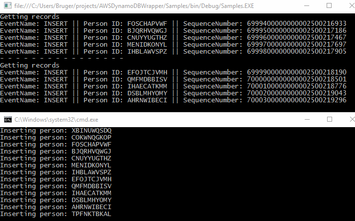
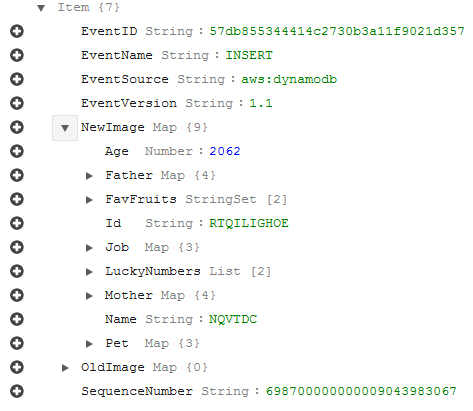
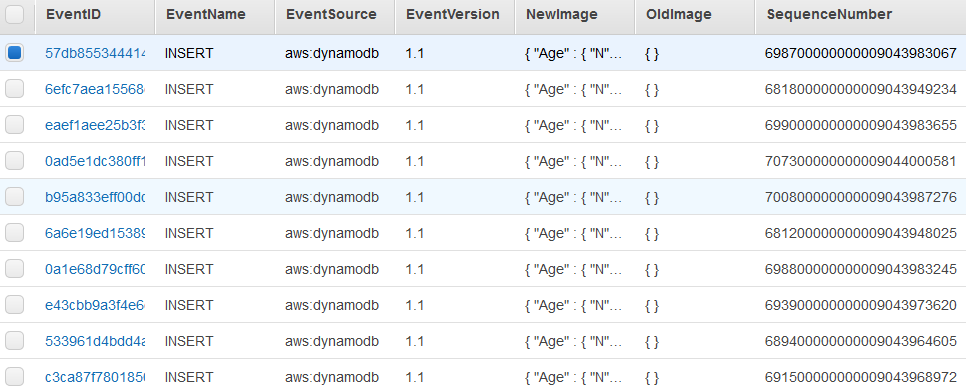

# AWSDynamoDBWrapper

A small project for making the use of DynamoDB in .NET projects easier.    
After looking at the [AWS Mapping example](http://docs.aws.amazon.com/amazondynamodb/latest/developerguide/DynamoDBContext.ArbitraryDataMapping.html) I thougt there had to be an easier way.  
I have created this small AWS DynamoDB Wrapper for making developent easier.   
Have allready implemented alot of DynamoDB features.      

UPDATE! We now support updating of Read/WriteCapacityUnits.

UPDATE! We now support DynamoDB Streams.    

UPDATE! Streams now returns List<AWSEventRecord>. Which contains new and old version of object changed. 
     

    
Top console is the dynamodb stream fetching new event every 5 seconds.    
Bottom console is datapump project inserting new person every second.

In the sample project I have a data structure looking like this:

Person:
* Id (String)
* Name (String)
* Age (Int?)
* FavFruits (List<String>)
* Human (Bool?)
* Pet (Pet)
* Pets (List<Pet>)
* Father (Person)
* Mother (Person)
* Job (Job)

Pet:
* Name (String)
* Age (Int)
* PetJobs (List<Job>)

Job:
* JobName (String)
* Salary (Int)
* Seniority (Int)

A good structure with some depth giving alot of work making DimensionTypeConverter for DynamoDB.

To get starting just make a DynamoDBContext.
~~~~~~.NET
// Create a DynamoDBContext
DynamoDBContext ddbc = new DynamoDBContext(
    "Person", // Table name
    RegionEndpoint.EUWest1, // Region
    "##############", // Access key
    "#########################################"); // Secret key
~~~~~~

~~To insert a object simply implement the abstact class to your classes like so:~~    
Nope. Not any more! AWSDocumentConverter is now fully static. Which means some things have changed like:
~~~~~~.NET
Person p = AWSDocumentConverter.ToObject<Person>(document);
//Or
Person person = new Person(){
    ...
};
var document = AWSDocumentConverter.ToDocument(person);
~~~~~~

This will enable you to use DynamoDB like so:

~~~~~~.NET
// Insert a person
Person p = new Person(){
    Id = "something",
    Name = "Harry Twotter",
    .....
}

ddbc.Insert(person);
~~~~~~

~~~~~~.NET
// Get a person by id
Person person = ddbc.Get<Person>("uniqueid");
~~~~~~

~~~~~~.NET
// Insert alot of persons at the same time. Use Batch insert.
List<Person> persons = new List<Person>();

.... // Add alot of persons

ddbc.BatchInsert(persons);
~~~~~~

~~~~~~.NET
// Get a list of all person with age greater than 30.
ScanFilterCondition sfc = new ScanFilterCondition("Age", ScanOperator.GreaterThan, 30);
List<Person> result = ddbc.Scan<Person>(new List<ScanFilterCondition>() {sfc}).ToList();
~~~~~~

~~~~~~.NET
// Atomic counter of attribute in DynamoDB
// id, attribute, value
ddbc.AtomicCounter("uniqueid", "Age", -21);
~~~~~~

~~~~~~.NET
// Conditional Update in DynamoDB. Eg. only update if Person Father's Mother's Father name is "Troels" (great-grandfather name).
ddbc.ConditionalUpdate(person, "Father.Mother.Father.Name", "Troels");
~~~~~~

~~~~~~.NET
// Updating Read/WriteCapacityUnits for your DynamoDB (Eg. Needing more or less performance)
ddbc.AWSDynamoDBTable.ReadCapacityUnits = 15;
ddbc.AWSDynamoDBTable.WriteCapacityUnits = 15;
ddbc.AWSDynamoDBTable.UpdateTable();
~~~~~~

~~~~~~.NET
// DynamoDB Stream getting all events (Delete, Update, Insert).
// Note this example, gets the NewImage, which will fail if you are deleteing objects. (Nullpointer exception).
// The stream is smart and remembers which Sequence last scanned, and follows up where it left of.
var stream = ddbc.GetAWSDynamoDBStream(AWSDynamoDBIteratorType.LATEST);

while (true)
{
    Thread.Sleep(5000);
    var records = stream.GetRecords<Person>();
    foreach (var record in records)
    {
        Console.WriteLine("EventName: " + record.EventName + " || Person ID: " + record.NewImage.Id + " || SequenceNumber: " + record.SequenceNumber);
    }
}
~~~~~~

~~~~~~.NET
// With the new AWSEvemtRecord class added, we can do some fancy stuff.
// Like saving all events from Persons table into a new table.
// AWS only stores events upto 24 hours.
// With this neat little trick you can make your own DynamoDB EventStore.
// Or save these events in any other event store you would like :)

AWSDynamoTableConfig config = new AWSDynamoTableConfig("PersonEvents", typeof(string), "EventID", 1, 5);
// Create a DynamoDBContext
DynamoDBContext ddbcEvents = new DynamoDBContext(
    RegionEndpoint.EUWest1,
    "##################",                           // Access key
    "#########################################",    // Secret key
    config                                          // Table config
    );

var stream = ddbc.GetAWSDynamoDBStream(AWSDynamoDBIteratorType.LATEST);

while (true)
{
    Thread.Sleep(5000);
    var records = stream.GetRecords<Person>();
    foreach (var record in records)
    {
        ddbcEvents.Insert(record);
    }
}
~~~~~~

With the new AWSEventRecord we can see the changed made to Person with both Snapshots saved (NewImage and OldImage).    
Combined with alot of extra Event data like Event name (Insert, Update, Delete).   
If for some reason your app should crash, it's easy to start up again from Last SequenceNumber and just start saving the new events since then.   
And if you dont mind about performance, you can just get all event's last 24 hours from aws and run import again to be sure you didn't miss any events.

Here is how a event with a Person Insert looks like in AWS.    

Heres just a small list of Insert events stored for Persons table. Stored in new table PersonEvents.
    

Joshua Jesper Krægpørh Ryder.
Software developer at First Agenda (Århus Denmark.)
Contact me at Josh@TopSwagCode.com